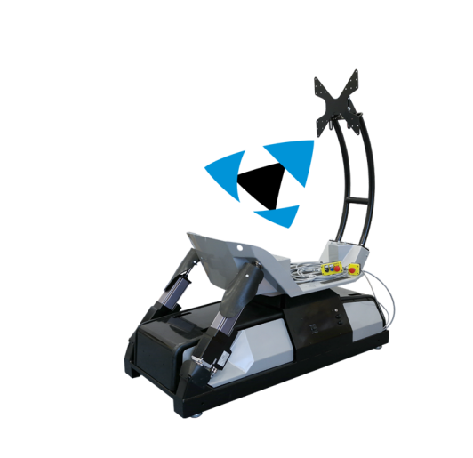
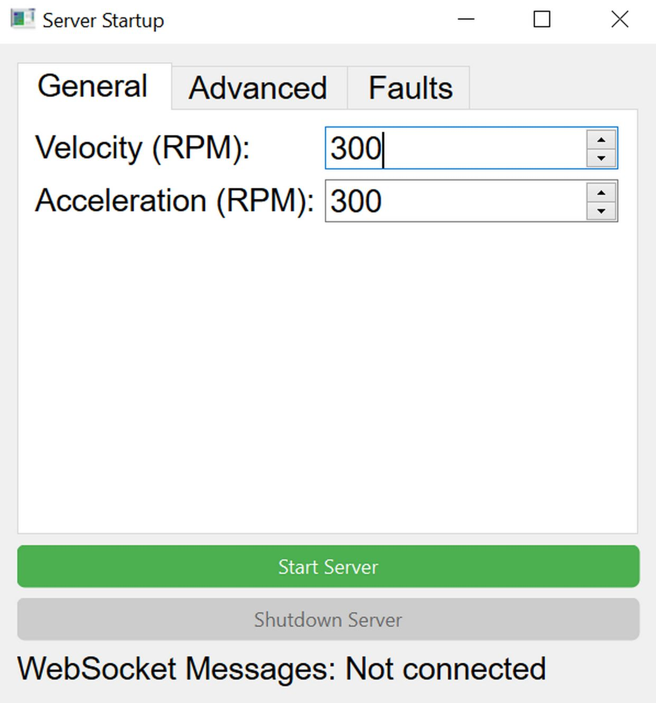
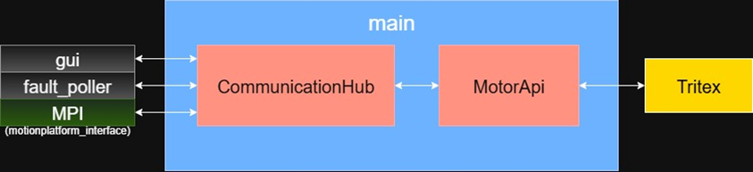
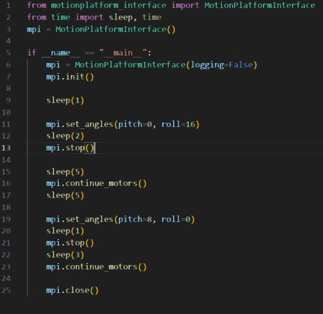

# Descritption 
This project built an API with Python for a 2DOF motion platform built by [Mevea](https://mevea.com/), that uses two Tritex II T2M90-0602 servo motors for pitch and roll. The purpose of this project was to detach from Meveas system and make a easier interface that talks straight to the motors instead. The project is primarily meant to be used through the GUI, but with small modifications you can just use the socket server part, that is the primary interface for commanding the motors.

# Architecture
The main interface(CommunicationHub) is a websocket server where you can send actions for what you want to do. For example you can communicate to different processes through it or command the motors to rotate. Fault poller is a separate process that does just that and it communicates to the GUI through communication hub if there is a fault that needs to be cleared. Certain faults are considered absolute and they shutdown the application and tell the user that the motors are in need of maintenance and can't be used anymore. MotorApi module is the one that manages all the commands for the tritex drivers with modbusTCP protocol. MPI is just a interface that uses the correct message format that the server is expecting so that the usage is more convinient.

The rotation equation:

 13.6775 + 1.8464*pitch_value - 0.8026*roll_value + 0.0053*math.pow(pitch_value, 2) - 0.0050*pitch_value*roll_value +  0.0011*math.pow(roll_value, 2)
 
that calculates the pitch and roll, was derived from a simple quadratic regression model.

## Contributors
- [Emil](https://github.com/https://github.com/Emil-Frisk)
- [Vann](https://github.com/vann1)